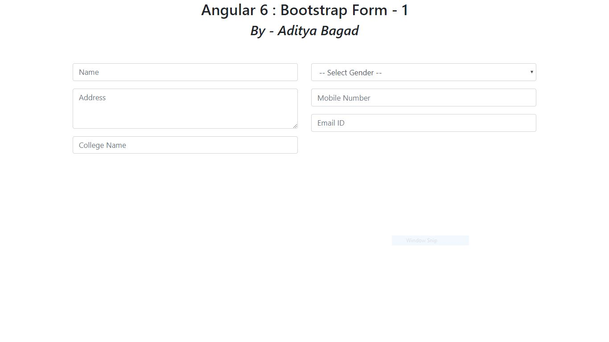
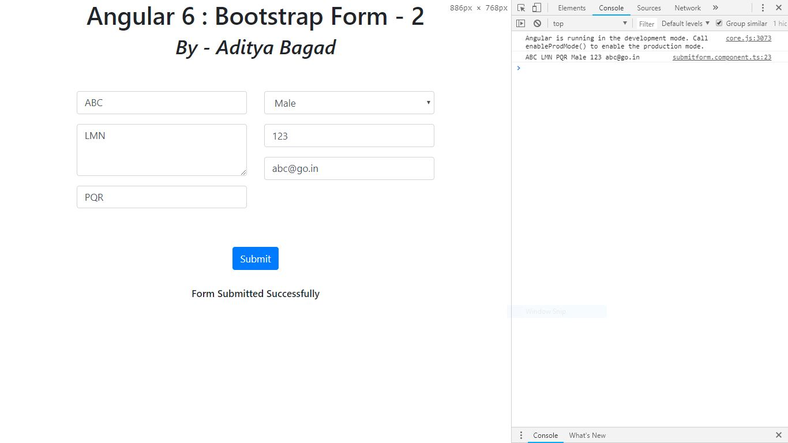
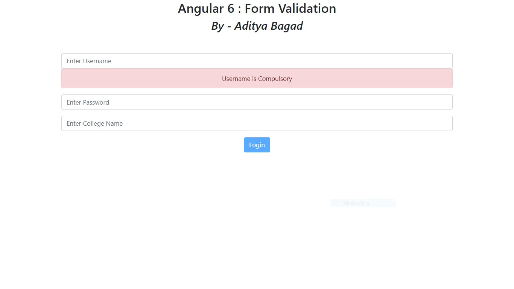
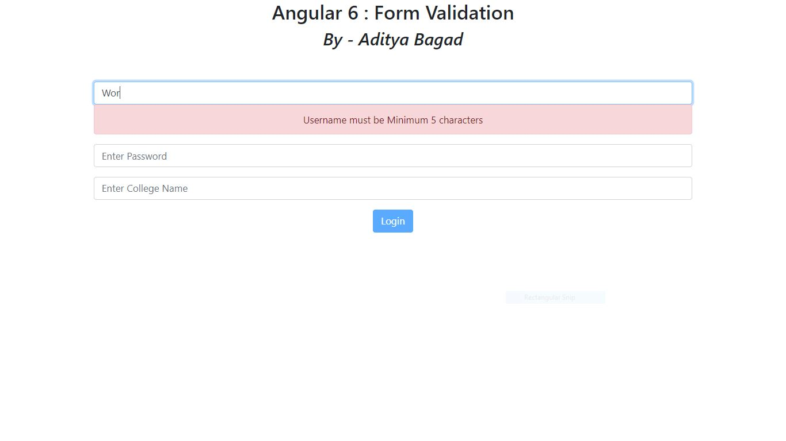

## Contents

1. Create Angular Application which displays Admission form. Use “Bootstrap” to design the form. Admission form contains following details of students as Students name, Address, Gender, Mobile number, College name, Email ID, Batch name. Use appropriate bootstrap components for each form details.

2. Use the form which is created by above application and add one new button as submit. When user press submit button we have to display all entered information into log (Use Console.log ()) Add event listener for the button and fetch data from the form and display on console.

3. Create angular application which Accept username and its college name from user. Username is compulsory and it should contain minimum 5 characters in it. College name field is also compulsory but maximum length of password should be 7 characters.

