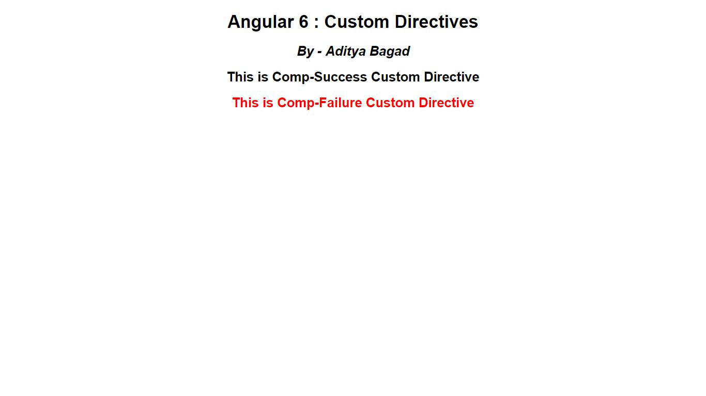
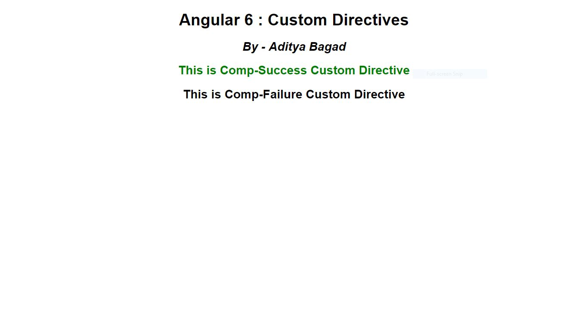
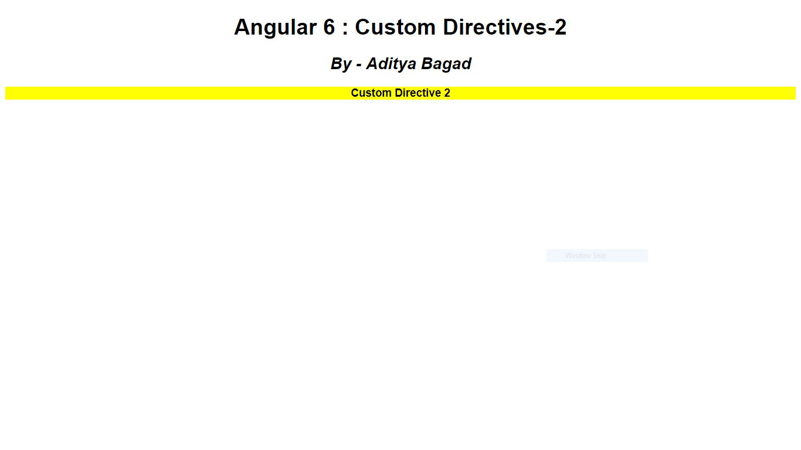

## Contents

1. Create angular application which creates two custom directives as Comp-Success and Comp-Failure. In case of Comp-Success directive when we move the mouse cursor over the data element its text colour becomes green and in case of Comp-Failure text colour becomes red. When we remove mouse courser its colour becomes black. We have to use that both directives in one .html file.

2. Create angular application which creates one custom directive named as Custom-Style. In this directive we have to set background of our text as yellow and type of the text should be bold. Use that custom directive in .html file. In this application there is no need to handle mouse listeners.
