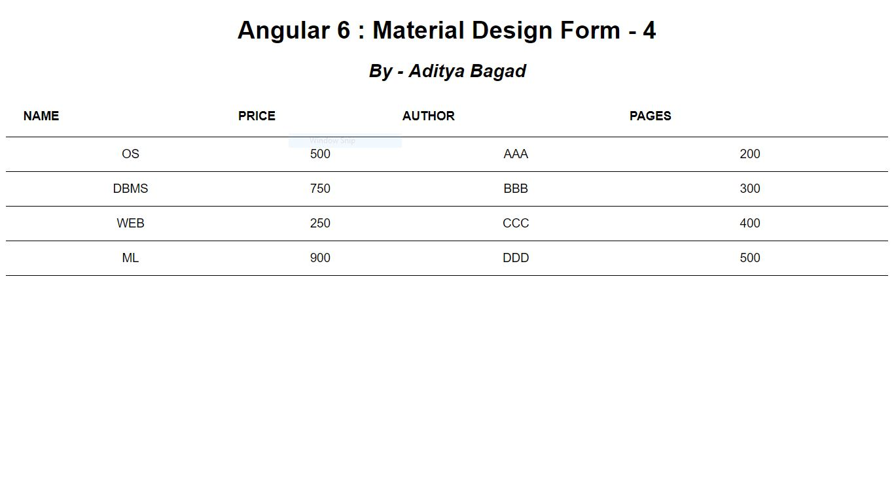

## Contents

1.Create angular application which creates login form which accepts Username andPassword from user. When user clicks submit button username and password shouldbe stored in typescripts class characteristics.

2.Create angular application which creates one form for the travelling portal. In thatportal we have to display names of cities as a list and user will select any specific city.We have to accept start date and end date of vacation from user with its necessarydetails.

3.Create angular application which contains one form which accept car details(Name, type, colour, Carnumber, number of seats) from user.Provide submit button at the end. Car number is compulsory filled in our form. 

4.Create angular application which displays one table which contains names of fivebooks with its author name, number of pages in it and its price.

